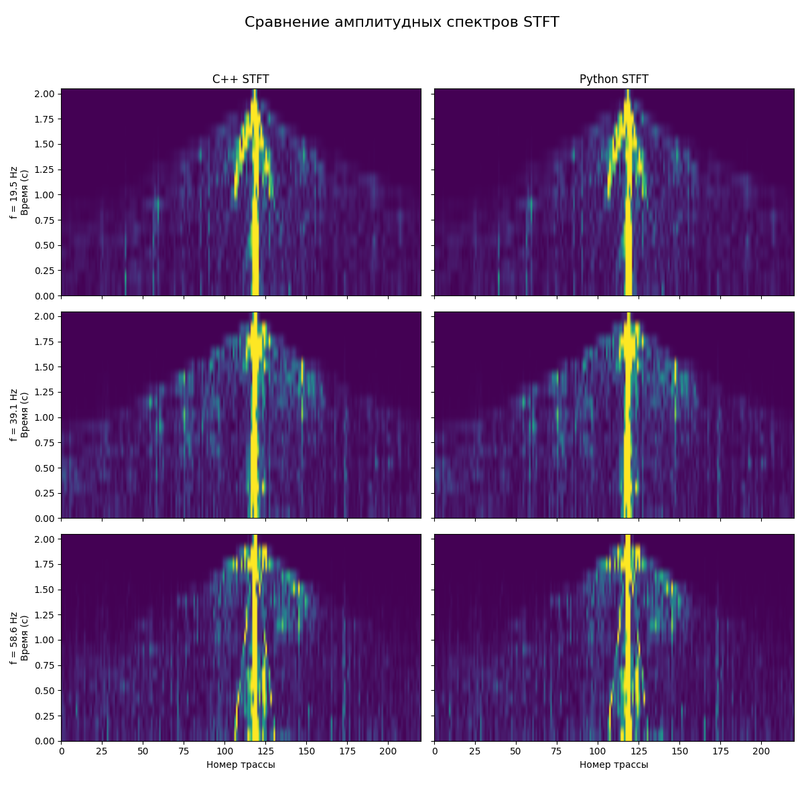
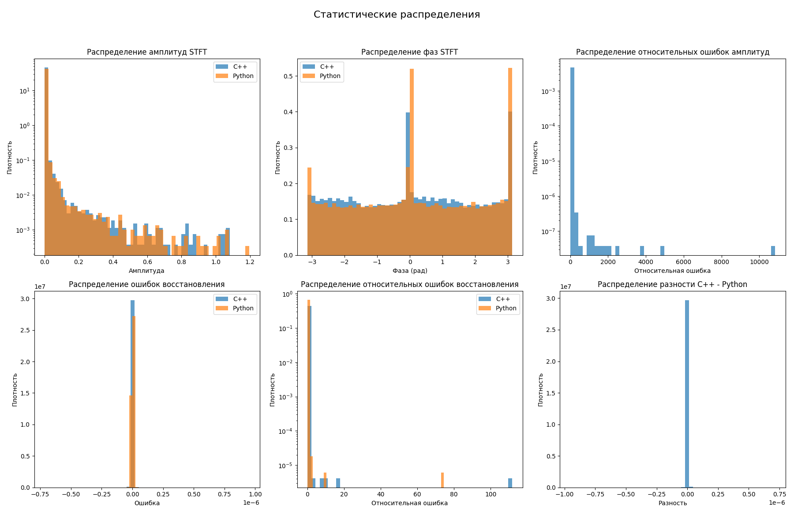

# STFT Header-Only Library

A C++ header-only library for Short-Time Fourier Transform (STFT) and inverse STFT operations. This library implements the same logic as `scipy.signal.stft` and `scipy.signal.istft` from Python's SciPy library, providing a high-performance C++ alternative.

## Features

- **Header-only**: Just include `stft.hpp` in your project
- **FFTW Integration**: Uses FFTW library for high-performance FFT operations
- **Template-based**: Supports both `float` and `double` precision
- **Boundary Handling**: Supports zero-padding and even extension boundary conditions
- **Perfect Reconstruction**: Implements overlap-add method for perfect signal reconstruction
- **SciPy Compatible**: Follows the same mathematical approach as `scipy.signal.stft`

## Dependencies

- **FFTW3**: Fast Fourier Transform library
- **C++11** or later
- **Standard Library**: `<vector>`, `<complex>`, `<cmath>`, `<stdexcept>`, `<numeric>`

## Installation

1. Install FFTW3:
   ```bash
   # Ubuntu/Debian
   sudo apt-get install libfftw3-dev
   
   # macOS
   brew install fftw
   
   # Windows (with vcpkg)
   vcpkg install fftw3
   ```

2. Include the header in your project:
   ```cpp
   #include "stft.hpp"
   ```

## API Reference

### Enumerations

```cpp
enum class BoundaryType { 
    ZERO,   // Zero-padding at boundaries
    EVEN    // Even extension at boundaries
};
```

### Main Functions

#### STFT Forward Transform

```cpp
template<typename T>
std::vector<std::vector<std::complex<T>>> STFT_forward(
    const std::vector<T>& signal,           // Input signal
    int frame_size,                         // Window/frame size
    int hop_size,                          // Hop size between frames
    BoundaryType boundary = BoundaryType::ZERO  // Boundary condition
);
```

**Parameters:**
- `signal`: Input real-valued signal as `std::vector<T>`
- `frame_size`: Size of the analysis window (must be > 0)
- `hop_size`: Number of samples between consecutive frames (must be > 0)
- `boundary`: Boundary condition for signal extension (default: `ZERO`)

**Returns:**
- `std::vector<std::vector<std::complex<T>>>`: STFT result
  - First dimension: time frames
  - Second dimension: frequency bins (0 to `frame_size/2`)
  - Each element: complex value representing magnitude and phase

**Example:**
```cpp
std::vector<float> signal = {1.0f, 2.0f, 3.0f, ...};
auto stft_result = STFT_forward<float>(signal, 64, 32, BoundaryType::EVEN);
```

#### STFT Inverse Transform

```cpp
template<typename T>
std::vector<T> STFT_inverse(
    const std::vector<std::vector<std::complex<T>>>& stft_result,  // STFT data
    int frame_size,                                                // Window/frame size
    int hop_size,                                                 // Hop size between frames
    int original_length,                                          // Original signal length
    BoundaryType boundary                                         // Boundary condition
);
```

**Parameters:**
- `stft_result`: STFT data from `STFT_forward`
- `frame_size`: Size of the synthesis window (must match forward transform)
- `hop_size`: Hop size between frames (must match forward transform)
- `original_length`: Length of the original signal
- `boundary`: Boundary condition (must match forward transform)

**Returns:**
- `std::vector<T>`: Reconstructed real-valued signal

**Example:**
```cpp
auto reconstructed = STFT_inverse<float>(stft_result, 64, 32, signal.size(), BoundaryType::EVEN);
```

### Helper Functions

```cpp
// Generate Hann window
template<typename T>
std::vector<T> hann_window(int N);

// Apply even extension for boundary handling
template<typename T>
std::vector<T> apply_even_extension(const std::vector<T>& signal, int pad_size);
```

## Test Programs

This repository includes test programs to validate the library functionality and compare it with Python's SciPy implementation.

### C++ Test Program (`cpp_stft.cpp`)

Demonstrates basic STFT usage and validates perfect reconstruction:

```bash
# Compile
g++ -O3 -std=c++11 cpp_stft.cpp -lfftw3 -lfftw3f -o cpp_stft

# Run
./cpp_stft
```

**Features:**
- Loads seismogram data from binary file
- Performs forward STFT with even boundary extension
- Performs inverse STFT for reconstruction
- Calculates reconstruction quality metrics
- Saves STFT data and reconstructed signal

### Python Test Program (`py_stft.py`)

Equivalent implementation using SciPy for comparison:

```bash
# Run
python py_stft.py
```

**Features:**
- Uses `scipy.signal.stft` and `scipy.signal.istft`
- Same parameters and boundary conditions as C++ version
- Saves results in compatible format for comparison

### Comparison Script (`compare_stft.py`)

Comprehensive comparison between C++ and Python implementations:

```bash
# Run
python compare_stft.py
```

**Features:**
- Loads and compares STFT results from both implementations
- Generates visualization plots
- Performs statistical analysis
- Creates detailed comparison reports

## Generated Visualizations

The comparison script generates several visualization plots in the `pics/` directory:

### 1. Seismogram Comparison (`comparison_seismograms.png`)


Shows:
- Original seismogram
- Reconstructed seismograms (C++ and Python)
- Difference plots highlighting reconstruction errors

### 2. STFT Spectra Comparison (`comparison_stft_frames.png`)



Shows:
- STFT amplitude spectra at different frequencies (20, 40, 60 Hz)
- Side-by-side comparison of C++ vs Python implementations
- Time-frequency representations

### 3. Statistical Distributions (`statistics_histograms.png`)



Shows:
- Distribution of STFT amplitudes and phases
- Error distributions for reconstruction quality
- Relative error analysis between implementations

## Usage Examples

### Basic STFT Analysis

```cpp
#include "stft.hpp"
#include <vector>

int main() {
    // Create test signal
    std::vector<float> signal(1000);
    for (size_t i = 0; i < signal.size(); ++i) {
        signal[i] = std::sin(2.0f * M_PI * 100.0f * i / 1000.0f); // 100 Hz sine wave
    }
    
    // Perform STFT
    auto stft_result = STFT_forward<float>(signal, 64, 32, BoundaryType::EVEN);
    
    // Perform inverse STFT
    auto reconstructed = STFT_inverse<float>(stft_result, 64, 32, signal.size(), BoundaryType::EVEN);
    
    return 0;
}
```

### Seismogram Processing

```cpp
#include "stft.hpp"
#include <fstream>

int main() {
    // Load seismogram data
    std::vector<float> seismogram;
    // ... load data ...
    
    // STFT parameters
    int frame_size = 64;
    int hop_size = 32;
    
    // Forward transform
    auto stft_data = STFT_forward<float>(seismogram, frame_size, hop_size, BoundaryType::EVEN);
    
    // Process STFT data (e.g., filtering, denoising)
    // ... processing ...
    
    // Inverse transform
    auto processed_seismogram = STFT_inverse<float>(stft_data, frame_size, hop_size, 
                                                   seismogram.size(), BoundaryType::EVEN);
    
    return 0;
}
```

## Performance Considerations

- **FFTW Planning**: The library uses `FFTW_ESTIMATE` for plan creation. For repeated operations with the same parameters, consider pre-planning FFTW operations.
- **Memory Allocation**: FFTW memory is allocated/deallocated for each function call. For high-performance applications, consider reusing FFTW buffers.
- **Template Instantiation**: The library supports both `float` and `double` precision. Choose based on your accuracy requirements.

## Mathematical Details

The implementation follows the standard STFT definition:

**Forward STFT:**
```
X[k, n] = Σ_{m=0}^{N-1} x[n·hop_size + m] · w[m] · e^{-j2πkm/N}
```

**Inverse STFT:**
```
x[n] = Σ_{k=0}^{N-1} X[k, n] · e^{j2πkn/N} / Σ_{m} w²[m]
```

Where:
- `w[m]` is the Hann window
- `N` is the frame size
- `hop_size` is the step between frames
- Overlap-add method is used for reconstruction

## License

This library is provided as-is for educational and research purposes. Please ensure compliance with FFTW license when using this library.

## Contributing

Feel free to submit issues, feature requests, or pull requests to improve the library. 